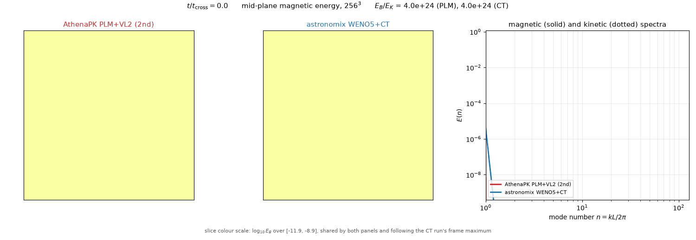
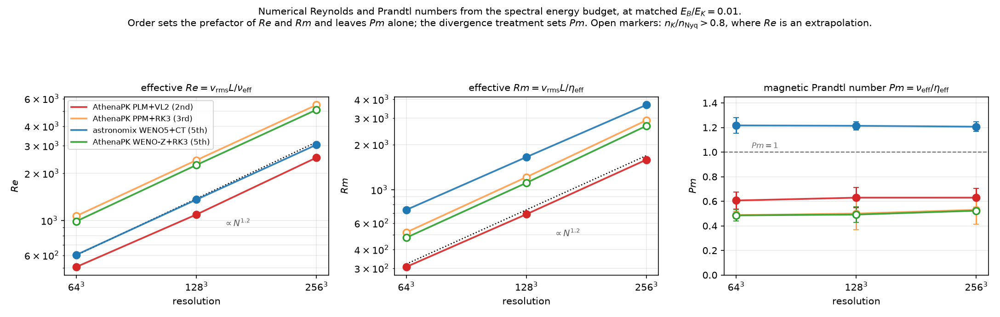

# Where the dynamo speed comes from

A driven subsonic MHD turbulence box run with two codes at `256^3`, and the
measurement of why one of them grows a magnetic field faster than the other.

**Summary of what is and is not established.** The numerical magnetic Prandtl
number `Pm = nu_eff / eta_eff` is a scheme constant, flat over a factor of four
in resolution, and it separates constrained transport (1.21) from GLM cleaning
(0.49-0.63) at any reconstruction order. That much is solid. It is *associated*
with a faster dynamo, and an explicit-viscosity intervention inside one code
reproduces the effect. But the advantage it buys shrinks with resolution
(2.15x -> 1.67x from `64^3` to `256^3`) while `Pm` does not, a
the growth rate at `64^3` scatters by 20% between forcing realisations — wider
than the collapse it is fitted to — and only two of the four schemes pass the
resolvedness test. **Read the
`Pm` split as a robust measurement and the causal story as incomplete.**

* **AthenaPK PLM+VL2+HLLD** — 2nd-order finite volume, GLM divergence cleaning
* **astronomix WENO5+SSP-RK4** — 5th-order finite difference, constrained
  transport

Same box, same forcing amplitude, same isothermal sound speed, matched on the
achieved flow rather than calibrated (`Mach` = 0.68-0.73 in every run quoted
here). Full setup, controls and caveats: [`README.md`](README.md).

## The two dynamos, side by side



Mid-plane magnetic energy at `256^3`, on a shared logarithmic colour scale that
follows the constrained-transport run's frame maximum, plus both magnetic
spectra (solid) with the kinetic spectra behind them (dotted). The spectrum axes
are fixed for the whole animation, so the growth is visible rather than
normalised away; the slice colour scale is not, and its current range is printed
under each frame, as is each run's `E_B/E_K`.

What it shows, in order:

* **The kinetic spectra lie on top of each other** for the whole kinematic
  phase. Whatever separates these two runs is in the induction equation, not in
  the flow they carry.
* **The CT magnetic spectrum sits above the GLM one at every scale**, and the
  gap is widest at high `n`: at `t / t_cross = 6` the two are at
  `E_B/E_K` = 6.1e-2 and 2.5e-2, a factor 2.4, and the CT spectrum extends
  visibly further before turning over. The CT slice is correspondingly more
  filamentary at the grid scale.
* **By saturation the two spectra nearly overlie each other**, and the gap in
  `E_B/E_K` has narrowed: averaged over `t / t_cross >= 28` it is 0.305 (PLM)
  against 0.428 (CT), a factor 1.40, where at `64^3` the same comparison gives
  0.076 against 0.154, a factor 2.03.

Two cautions on reading the frames, both of which caught an earlier draft of
this section. **Instantaneous is not time-averaged:** at `t / t_cross = 36.7`
the frame shows 0.400 and 0.429, which looks like near-equality, but 0.400 is
essentially PLM's maximum over the whole saturated window (which spans
0.232-0.406, against 0.311-0.533 for CT). Pick a different frame and the ratio
looks quite different. **And the trend in the saturated level is not clean:** the
CT/PLM ratio is 2.03 / 1.18 / 1.40 at `64^3` / `128^3` / `256^3`, not monotone,
and the ±25-30% temporal fluctuation above is comparable to the differences
being compared. The growth rate, not the saturation level, is the quantity this
study can order reliably.

The animation runs do double as a reproducibility check, since they are separate
integrations of the same configurations with a different dump cadence: they
recover the table runs' growth rates to 0.4% (CT) and 2.6% (PLM) and their
saturated levels to 0.2%. Output cadence does not perturb these `256^3`
realisations meaningfully.

## How `Re`, `Rm` and `Pm` are measured

Neither code has an explicit viscosity or resistivity. They cannot be read off;
they have to be measured, and the only place they are visible is the spectral
energy budget.

### 1. Spectra

Shell-summed over integer mode numbers. Each mode is assigned to the shell
`n = rint(|k| L / 2pi)`, and the shell is labelled by `k = 2 pi n / L`:

```
E_v(n) = (1/2) sum_{rint(|k|L/2pi) = n} |v-hat(k)|^2
E_B(n) = (1/2) sum_{rint(|k|L/2pi) = n} |B-hat(k)|^2
```

normalised so that `sum_n E_v(n)` recovers `<|v|^2> / 2`, and likewise for `B`.

That recovery is **not exact**, for one reason: only shells `n = 0 .. N/2` are
kept, so the corners of the Fourier cube outside the inscribed Nyquist sphere —
about 45% of the modes — are discarded. On a synthetic `k^-5/3` field that costs
1.1-1.5%. On these runs it costs **0.010%**, because numerical dissipation has
already emptied the grid-scale modes where the corners live. Checked directly on
a stored `64^3` dump in float64: summing all modes gives Parseval to 1.000000,
summing the retained shells gives 0.999899, and float32 changes neither. The
shell spectra should still be read as truncated to the inscribed sphere rather
than as a closed budget over all modes, but the truncation is negligible here,
and the band used for the diffusivities (`n / n_Nyquist = 0.2` to `0.7`) is well
inside the sphere in any case.

An earlier version of the audit reported this ratio as 0.9915-**1.0020** — above
one, which a sum over a subset of non-negative modal energies can never be. That
was a fault in the diagnostic, not the estimator: it compared the time-averaged
spectrum against `(1/2) <v_rms>^2` instead of `(1/2) <v_rms^2>`, and Jensen's
inequality makes the first smaller by 0.08-0.21% — exactly the observed excess.
Compared like with like the ratio is 0.9990-1.0000 for every AthenaPK run.

astronomix sits slightly lower at the coarse grids — 0.9903 at `64^3`, 0.9932 at
`128^3`, 0.9991 at `256^3` — and the reason is a genuine difference between the
two setups rather than a diagnostic one: the shell sum here excludes `n = 0`, and
astronomix's box carries a net bulk drift holding 0.96% / 0.67% / 0.08% of the
kinetic energy, where AthenaPK's is 1e-4 because it subtracts the mean momentum
from the forcing every step. A uniform drift is a Galilean shift and does not
change the dynamo, but it does exercise a finite-difference scheme's advection
error, so it is worth recording. It shrinks with resolution while `Pm` does not,
so it is not what produces the `Pm` split.

Note `E_v` is the *velocity* spectrum, not the `rho`-weighted kinetic energy.
That is deliberate: it is what lets the forcing term below be band-limited
exactly.

### 2. The ideal transfer

The exact non-dissipative right-hand side, projected onto the field and
shell-summed:

```
T_B(n) = sum_shell Re[ B-hat*(k) . (curl(v x B))-hat(k) ]
T_v(n) = sum_shell Re[ v-hat*(k) . a-hat(k) ],
         a = -(v.grad)v - grad p / rho + (curl B) x B / rho
```

Both are evaluated on the stored fields, by the same routine for both codes, so
a difference in the answer is a difference in the solvers and not in the
diagnostics.

### 3. What the scheme threw away

For a field evolving under ideal MHD plus forcing plus whatever the
discretisation does,

```
dE(n)/dt = T(n) + F(n) - D(n)      =>      D(n) = T(n) - dE(n)/dt   for n >= 4
```

with `T(n)` measured per snapshot and `dE(n)/dt` from consecutive snapshots.
`D(n)` is everything the scheme removed that ideal MHD does not.

Two points about the forcing term `F(n)`:

* **Magnetic: there is none.** `dB/dt = curl(v x B)` is the complete ideal
  induction equation; nothing forces `B`. So `D_B` is, with no omitted term,
  *every* way the discretisation changed the magnetic energy that ideal MHD does
  not — which matters because `eta_eff` is what the whole result rests on.

  For a GLM code that residual also contains the cleaning coupling, because the
  evolved equation is `dB/dt = curl(v x B) - grad psi` and only the first term is
  in `T_ideal`. That is not something to argue about: AthenaPK dumps `psi`, so
  the omitted contribution can simply be measured
  (`measure_glm_psi_term.py`),

  ```
  T_psi(n) = sum_shell Re[ B-hat*(k) . (-i k psi-hat(k)) ]
  ```

  and since `dE_B/dt = T_ideal + T_psi - D_num`, the measured residual is
  `D_B = D_num - T_psi`, so `T_psi` *is* the error. Measured over the averaging
  band of a saturated `64^3` PLM run, `T_psi` is negative — the coupling is a
  weak **sink** of magnetic energy, as divergence cleaning should be — of
  magnitude **2.9e-6 in `eta` units, against a measured total of 2.03e-3, i.e.
  0.14%**. Because the budget attributes that sink to the scheme, `eta_eff`
  *overstates* the scheme's own numerical resistivity by 0.14%; correcting it
  would move `Pm` 0.14% *towards* CT. `psi` itself carries 1.0% of the magnetic
  energy.

  That bound is measured on one `64^3` PLM run and is not asserted for the other
  schemes or resolutions, which would need their own dumps kept. It is quoted
  because it is three orders of magnitude below the effect under discussion, not
  because it has been established as universal.

  Two weaker checks agree. The fraction of in-band shells with `D_B <= 0` is 0.00
  for every run in the ladder, so the residual never has the wrong sign for a
  sink; and varying the Dedner damping `glmmhd_alpha` by a factor of 25 (0.02,
  0.1, 0.5 at `64^3`) moves `eta_eff` by 3% and `Pm` by 2%. **A CT code has no
  such term at all.**
* **Kinetic: zero above `n = 3` to one part in `10^3`.** Both codes force the
  *velocity* equation with a band-limited acceleration. AthenaPK adds
  `dt rho a` to the momentum with `rho` untouched, so the velocity increment is
  exactly `dt a` regardless of how `rho` varies; astronomix adds `amp w` to the
  velocity directly. In both, the only per-step modifications of the stored
  acceleration field are a global scalar (`accel_rms / rms(a)`, and astronomix's
  `amp`) and the subtraction of a single constant per component to zero the net
  momentum, which touches only `n = 0`. Neither changes the Fourier support.
  AthenaPK's `Rescale` and `InjectBlob` would break this, but both are disabled
  in these runs (`rescale_once_at_time` and `inject_once_at_time` are left at
  their `-1` defaults, so the routines return immediately).

  Over one step `v-hat'(k) = v-hat(k) + dt a-hat(k)`, so mode by mode

  ```
  |v-hat'(k)|^2 = |v-hat(k)|^2 + 2 dt Re[v-hat*(k) . a-hat(k)] + dt^2 |a-hat(k)|^2
  ```

  Both new terms are evaluated *at the same k*: the quadratic one is
  `|a-hat(k)|^2`, not the transform of a real-space product, so it does not
  convolve the support outwards. Both therefore vanish wherever `a-hat` does,
  i.e. everywhere above `n = 3`, with no size estimate needed. The measurement
  is consistent: `D_v(n)` is strongly negative for `n <= 3` and positive from
  `n >= 4` outwards.

`dE/dt` is taken as `E d(ln E)/dt` with `ln E` centre-differenced. For pure
exponential growth `ln E` is linear in `t`, so this is exact — which matters in
the kinematic phase, where a shell can double between snapshots.

### 4. Diffusivities and the dimensionless numbers

If the discarded energy were Laplacian, `D(n) = 2 nu k^2 E(n)`. Inverting that
defines a scale-dependent effective diffusivity:

```
nu_eff(n)  = D_v(n) / (2 k^2 E_v(n))
eta_eff(n) = D_B(n) / (2 k^2 E_B(n))
```

averaged over `n / n_Nyquist = 0.2 to 0.7` — above the forcing and the outer
scale, below where the un-dealiased products contaminate. Then

```
Re = v_rms L / nu_eff        Rm = v_rms L / eta_eff        Pm = Rm / Re = nu_eff / eta_eff
```

with `L = 0.5`, the driving wavelength (both codes force at `n ~ 2` in a unit
box). `L` is a convention: every absolute `Re` and `Rm` scales with it, and it
is the convention the dynamo literature quotes `Rm_crit` with. **`Pm` does not
depend on it at all.**

### 5. Where the measurement is taken

At matched `E_B/E_K = 0.01`, not in each code's saturated state. Each scheme
saturates at its own magnetic energy fraction (0.08 to 0.43 across this ladder)
and `Pm` drifts with that fraction, so a saturated-state table partly measures
the saturation level rather than the scheme. At `E_B/E_K = 0.01` the field is
still passive and every run carries the same turbulence.

Read in the saturated state instead, every GLM scheme appears to march toward
CT as the grid is refined (PLM 0.639 / 0.708 / 0.793 at `64^3` / `128^3` /
`256^3`, against CT's flat 1.063 / 1.028 / 1.033). That apparent convergence is
entirely the rising saturation level. **A resolution study of this quantity read
in the saturated state would have produced the opposite conclusion.**

## Results



| scheme | ord | div·B | N | `nu_eff` | `eta_eff` | `Re` | `Rm` | `Pm` | |
|---|---|---|---|---|---|---|---|---|---|
| AthenaPK PLM+VL2 | 2 | GLM | 64 | 1.36e-3 | 2.25e-3 | 505 | 306 | **0.61 ± 0.07** | |
| AthenaPK PLM+VL2 | 2 | GLM | 128 | 6.44e-4 | 1.02e-3 | 1092 | 687 | **0.63 ± 0.08** | |
| AthenaPK PLM+VL2 | 2 | GLM | 256 | 2.88e-4 | 4.58e-4 | 2520 | 1585 | **0.63 ± 0.08** | |
| AthenaPK PPM+RK3 | 3 | GLM | 64 | 6.48e-4 | 1.33e-3 | 1068 | 520 | **0.49 ± 0.03** | `n_K!` |
| AthenaPK PPM+RK3 | 3 | GLM | 128 | 2.87e-4 | 5.73e-4 | 2427 | 1213 | **0.50 ± 0.13** | `n_K!` |
| AthenaPK PPM+RK3 | 3 | GLM | 256 | 1.31e-4 | 2.47e-4 | 5468 | 2901 | **0.53 ± 0.12** | `n_K!` |
| AthenaPK WENO-Z+RK3 | 5 | GLM | 64 | 6.88e-4 | 1.42e-3 | 989 | 480 | **0.49 ± 0.05** | `n_K!` |
| AthenaPK WENO-Z+RK3 | 5 | GLM | 128 | 3.07e-4 | 6.25e-4 | 2260 | 1111 | **0.49 ± 0.06** | `n_K!` |
| AthenaPK WENO-Z+RK3 | 5 | GLM | 256 | 1.40e-4 | 2.67e-4 | 5093 | 2664 | **0.52 ± 0.03** | `n_K!` |
| astronomix WENO5 | 5 | **CT** | 64 | 1.14e-3 | 9.35e-4 | 604 | 735 | **1.22 ± 0.06** | |
| astronomix WENO5 | 5 | **CT** | 128 | 5.22e-4 | 4.30e-4 | 1359 | 1650 | **1.21 ± 0.03** | |
| astronomix WENO5 | 5 | **CT** | 256 | 2.33e-4 | 1.93e-4 | 3046 | 3675 | **1.21 ± 0.04** | |

Errors on `Pm` combine a moving-block bootstrap over snapshots with the spread
over every defensible band and window. `n_K!` marks runs whose implied
Kolmogorov scale `n_K = (nu^3 / eps_v)^(-1/4) / 2pi` exceeds Nyquist, where the
Laplacian reading of `nu` is an extrapolation; PPM and WENO-Z are flagged at
every resolution (0.89-1.18 of Nyquist), PLM and astronomix at none
(0.54-0.72). **Lean on the PLM and astronomix rows.**

Two things the three panels say:

* **`Re` and `Rm` behave identically up to a prefactor.** Both scale as
  `N^1.16-1.24` for every scheme; raising the reconstruction order moves the
  prefactor (`Rm` = 2.20 `N^1.19` for PLM, 2.99 `N^1.24` for PPM) and never the
  slope. Order buys a constant factor in `Rm`, not a better scaling.
* **`Pm` is flat in `N` and splits into two groups.** CT sits at
  1.217 / 1.214 / 1.207 over a factor of four in grid; every GLM scheme sits at
  0.49-0.63 regardless of whether it is 2nd, 3rd or 5th order. Adding a 3rd-order
  control with a different limiter (LimO3, `Pm` = 0.625 at `64^3`) puts four GLM
  schemes spanning three orders of accuracy inside a 0.49-0.63 band with no
  monotone trend in order.

  How far that identifies the *cause* is limited by the resolvedness flag. The
  two rows that pass it are PLM (0.61-0.63) and astronomix (1.21), and those two
  differ in everything at once — code, FV vs FD, characteristic vs component-wise
  reconstruction, EOS implementation, integrator, CFL, and GLM vs CT. The
  order-independence argument rests mostly on PPM and WENO-Z, which never pass
  it. All that can be said about their bias is what is observed: their `Pm`
  drifts up 8% as the flag improves from 1.18 to 0.89, and where that drift would
  end at full resolution is **not** established — it would take a converged
  reference run to bound the signs and relative sizes of the `nu` and `eta`
  biases, and none exists here. (An earlier draft argued the bias direction from
  `Pm = Rm/Re`; that argument was algebraically wrong and has been removed.)

  **So the supported statement is narrow:** resolved GLM gives `Pm ~ 0.62`,
  resolved CT gives 1.21, four GLM schemes across three orders of accuracy show
  no monotone trend in `Pm`, and the divergence treatment remains confounded with
  the rest of the implementation. Neither "order sets `Pm`" nor "constrained
  transport sets `Pm`" is *proven*; the first is disfavoured by the flat GLM
  family, the second is untested for want of a code with both.

## The dynamo speed

**Read this section against one fact stated up front: the growth-rate advantage
is not resolution-independent, even though `Pm` is.** It falls from 2.15x at
`64^3` to 1.67x at `256^3` against PLM, and from 1.76x to 1.16x against PPM.
Everything below describes a finite ladder, and the `256^3` column is the one to
quote.

The kinematic growth rate `Gamma = d ln E_B / dt`, fitted over
`E_B/E_K = 3e-3` to `3e-2`:

| scheme | `64^3` | `128^3` | `256^3` |
|---|---|---|---|
| AthenaPK PLM+VL2 (2nd) | 0.269 | 0.463 | 0.622 |
| AthenaPK PPM+RK3 (3rd) | 0.328 | 0.645 | 0.898 |
| AthenaPK WENO-Z+RK3 (5th) | 0.232 | 0.426 | 0.685 |
| astronomix WENO5+CT | 0.577 | 0.854 | 1.038 |

in units of `1 / t_cross`. Every AthenaPK value is confirmed to 2% by refitting
the same decade on the ~800-row history series; astronomix's `256^3` value,
fitted on three snapshots, is confirmed by a densely sampled zero-net-flux run
that gives the same 1.038 from 86 points.

**Both `Rm` and `Pm` are needed to order these.** Comparing laws with the
exponents fixed a priori, so that only the prefactor is fitted, over all twelve
runs:

| model | in-sample | leave-one-scheme-out |
|---|---|---|
| `Gamma ~ sqrt(Rm)` | 19.6% | 24.9% |
| `Gamma ~ sqrt(Re)` | 34.9% | 45.6% |
| **`Gamma ~ sqrt(Rm Pm)`** | **14.6%** | **17.8%** |
| `Gamma ~ sqrt(Rm) Pm` | 26.3% | 34.4% |
| `Gamma ~ N^a` (exponent fitted) | 30%+ | 40%+ |

so `Gamma t_cross = 0.0195 sqrt(Rm Pm)`. Resolution alone is the worst model of
the set, so this is not a disguised `N` dependence.

**How tightly can this be validated? Not more tightly than the growth rate
itself is reproducible.** The `glmmhd_alpha` ladder above, run at three damping
strengths with one forcing realisation each, gave `Gamma` = 0.177 / 0.269 /
0.321 — a factor 1.8, monotone in `alpha`, at `Rm` within 3% and `Pm` within 2%.
That looked like a falsification of `Gamma = f(Rm, Pm)`. It is not. The three
runs are *identical* to three digits out to `t / t_cross ~ 8` (`E_B` = 3.46e-5,
1.45e-4, 3.0e-4, 4.7e-4, 7.8e-4 at `t / t_cross` = 1, 2, 4, 6, 8; `Mach` and
`E_K` agree to four digits) and only then bifurcate — the signature of chaotic
divergence, not of a systematic parameter effect, and the growth-rate fit window
lies entirely after the bifurcation.

Repeating the ladder with three further forcing realisations at each `alpha`,
twelve runs in all, settles it:

| `glmmhd_alpha` | `Gamma` per realisation | mean | s.d. | `Pm` mean ± s.d. |
|---|---|---|---|---|
| 0.02 | 0.177, 0.225, 0.245, 0.217 | 0.216 | 0.028 | 0.616 ± 0.010 |
| 0.10 | 0.269, 0.186, 0.203, 0.223 | 0.220 | 0.036 | 0.623 ± 0.011 |
| 0.50 | 0.321, 0.219, 0.325, 0.211 | 0.269 | 0.063 | 0.625 ± 0.006 |

One-way ANOVA across `alpha`: `F` = 1.72, `p` = 0.23. **There is no significant
`alpha` effect on the growth rate** — nor on `Pm` (spread 1.5%), `Rm` (1%) or
`eta_eff` (3%). What the twelve runs *do* give is the noise floor: pooled over
all of them, `Gamma` at `64^3` scatters by **20%** between forcing realisations
while `Pm` scatters by 1.7%.

That number is the honest limit on the collapse. Its 14.6% residual is *below*
the 20% realisation scatter of its own dependent variable, so
`sqrt(Rm Pm)` should be read as **an empirical regression over this ladder that
is consistent with the data to within the noise**, not as a validated law. Any
quantity derived from it — the grid-equivalence factors in
[`README.md`](README.md), for instance — inherits at least that 20%.

**Which term dominates depends on what you compare against.** At `64^3`:

| astronomix over | measured `Gamma` ratio | `sqrt(Rm` ratio`)` | `sqrt(Pm` ratio`)` |
|---|---|---|---|
| PLM (2nd) | 2.15 | 1.55 | 1.42 |
| PPM (3rd) | 1.76 | 1.19 | 1.58 |
| WENO-Z (5th) | 2.49 | 1.24 | 1.58 |

Against a 2nd-order code it is half `Rm` and half `Pm`. Against a modern
high-order GLM code, raising the order has already closed most of the `Rm` gap
and essentially all the remaining speed is the Prandtl number.

**An intervention the law predicts.** Imposing an explicit Laplacian viscosity
inside AthenaPK PLM — one scheme, one grid, one knob — moves `Pm` without
changing the code:

| imposed `nu` | `Pm` | `Rm` | `Re` | `Mach` | `Gamma` | saturated `E_B/E_K` |
|---|---|---|---|---|---|---|
| none | 0.606 | 306 | 505 | 0.689 | 0.269 | 0.076 |
| 1e-3 | 1.066 | 340 | 319 | 0.648 | 0.376 | 0.172 |
| 2e-3 | 1.440 | 344 | 239 | 0.650 | 0.463 | 0.166 |

`Rm` is not held fixed — it rises 11% and 12%, because a smoother flow makes less
small-scale field and so less numerical resistivity — so the comparison has to be
against the full two-variable law, not the `Pm` factor alone. It is:
`sqrt(Rm Pm)` predicts 1.398 and 1.634, measured 1.398 and 1.721 — the first
step agrees to 0.0%, the second is 5.3% high. Both are inside the 20%
realisation scatter established above, so this is a *compatible* intervention
rather than a validated prediction; what it adds to the scheme comparison is
that the association survives being manipulated inside one code, which no purely
correlational reading would give. It also moves more than `Pm`: `Mach` falls 6%
and `Re` by a factor of two. The saturated magnetic energy also
rises from 0.076 to 0.172, landing on astronomix's 0.154 from an `Rm` 2.2x lower.

## What is missing

**1. Why `Pm` matters is not demonstrated here.** The obvious mechanism — that
the field is stretched by the smallest eddies it can feel, so
`Gamma ~ sqrt(eps / max(nu, eta))` — is testable with these measurements and it
**fails**: 23.3% in-sample and 29.6% out-of-sample, worse than `sqrt(Rm Pm)` and
worse than `sqrt(Rm)` alone. Normalised by that rate the CT scheme is still
40-70% faster at `64^3` and `128^3`. What survives is the threshold explanation —
`Rm_crit` rises as `Pm` falls through unity, so at equal `Rm` a `Pm ~ 0.5` scheme
runs nearer its own critical point. Our threshold measurement (`Rm_crit` =
176-225 at `Pm ~ 0.4`, from an explicit-resistivity ladder) is consistent with
the published curve, but the explanation is borrowed rather than shown.

**2. Constrained transport is not isolated.** astronomix is the only CT code
here and AthenaPK the only GLM one, so CT rides with finite differences,
characteristic-wise flux splitting and a genuinely isothermal EOS. Individually
ruled out by controls at `64^3`: FD-vs-FV representation 3% (box-filtering
astronomix's point values into cell averages), float64 4.6%, CFL 0.15 3.3%,
forcing realisation 2-4%, aliasing 2% (Orszag 3/2 dealiasing), Dedner damping
across a factor of 25 2% — against a factor-two gap. Order is ruled out by the
four-scheme sweep. What remains is "the induction discretisation together with
the characteristic decomposition", and separating those needs a code offering
both CT and GLM. Neither does, and only two of the four schemes are resolved
well enough to contribute to the comparison at all.

**3. The speed advantage is not resolution-independent, and `Pm` does not
explain that.** astronomix at `256^3` falls 20% below its own collapse
(`Gamma / sqrt(Rm Pm)` = 0.0193 / 0.0191 / **0.0156**) while all three AthenaPK
schemes at `256^3` sit on the line (0.0197, 0.0229, 0.0184). So the measured
advantage decays — 2.15 / 1.85 / 1.67 against PLM, 1.76 / 1.32 / 1.16 against
PPM — even though `Pm` is flat. **This is unexplained.** An earlier reading of
it as a general high-`Rm` flattening was falsified by the `256^3` AthenaPK runs.
Any claim about what CT is worth at production resolution should quote the
`256^3` column, not the `64^3` one.

**4. Two of the four schemes are never resolved.** PPM and WENO-Z carry
`n_K / n_Nyquist` = 0.89-1.18 at every resolution, so their `Re` — and therefore
their `Pm` — is partly an extrapolation, and their `Pm` drifts up 8% from `64^3`
to `256^3` in step with the flag improving. The conclusion does not depend on
them (PLM and astronomix alone carry it), but they cannot be used as independent
confirmation either.

**5. No `512^3` point**, so whether the shrinking advantage in item 3 continues,
plateaus or reverses is unknown. And only the `64^3` runs have a second forcing
realisation; at `128^3` and `256^3` each row is a single realisation, whose
growth rate at `64^3` was seen to scatter by 4% (astronomix) to 45% (PLM, which
sits near threshold there).

## Reproducing

```bash
python make_mechanism_table.py --summary       # the table above
python make_mechanism_table.py --audit         # the checks behind it
python make_mechanism_table.py --collapse      # the growth-rate model comparison
python make_mechanism_table.py --calibration   # measured vs imposed diffusivity
python make_mechanism_figure.py                # figures/dynamo_mechanism.png
python make_dynamo_movie.py --data data/anim   # figures/dynamo_side_by_side.gif
python measure_glm_psi_term.py \
       --dumps /export/data/lstorcks/mhd_dynamo/athenapk_psiprobe_plm_N64
```

The animation needs runs carrying a per-snapshot slice series:

```bash
python dynamo_convergence.py --n 256 --seed-field sin --beta 1e6 --tcross 40 \
       --nsnap 120 --slice-series --tag anim_N256 --outdir data/anim
python athenapk_turb.py --n 256 --scheme plm --seed-field sin --beta 1e6 \
       --tcross 40 --nsnap 120 --slice-series --tag anim_plm_N256 --outdir data/anim
```
