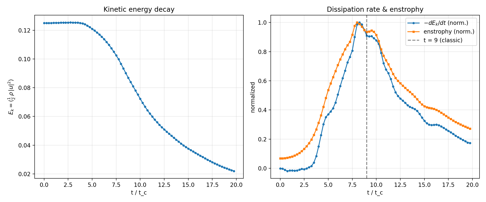
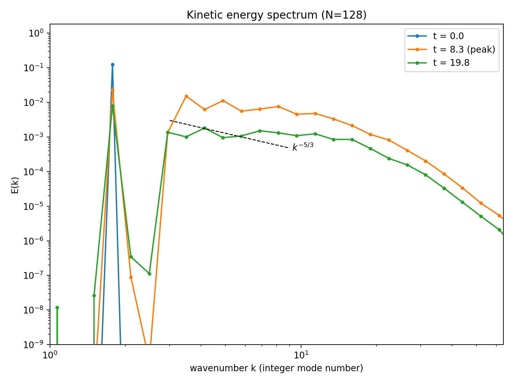
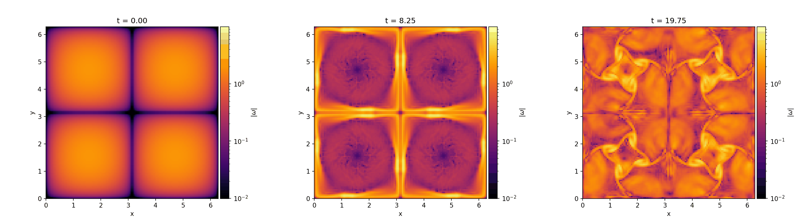
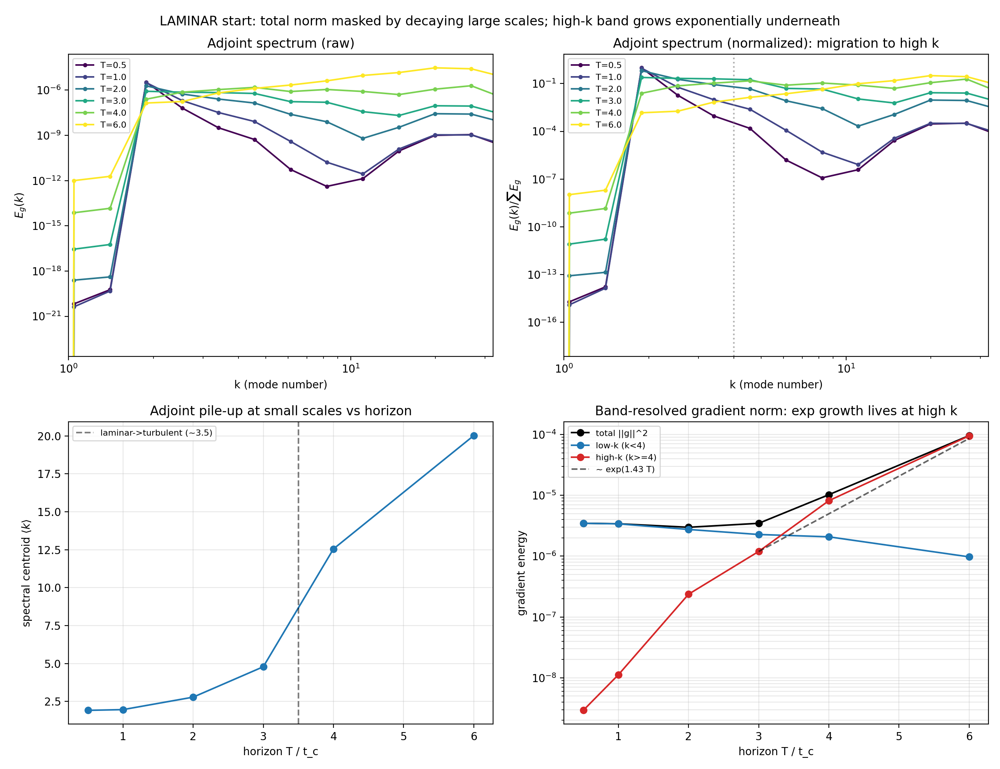
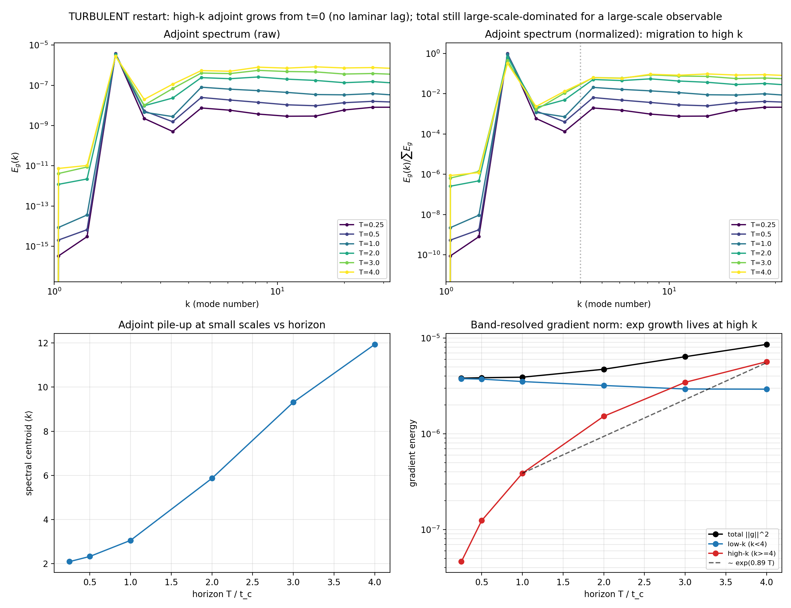
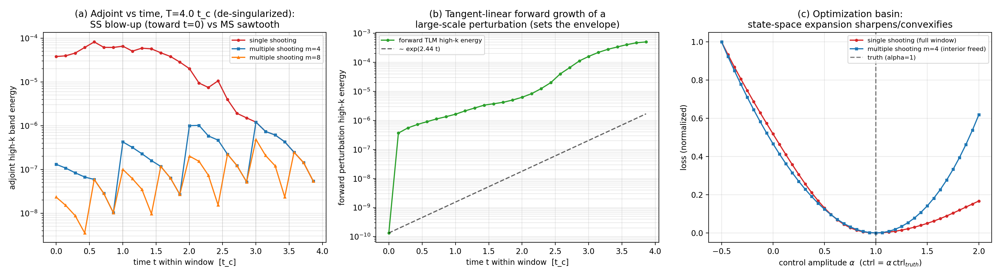
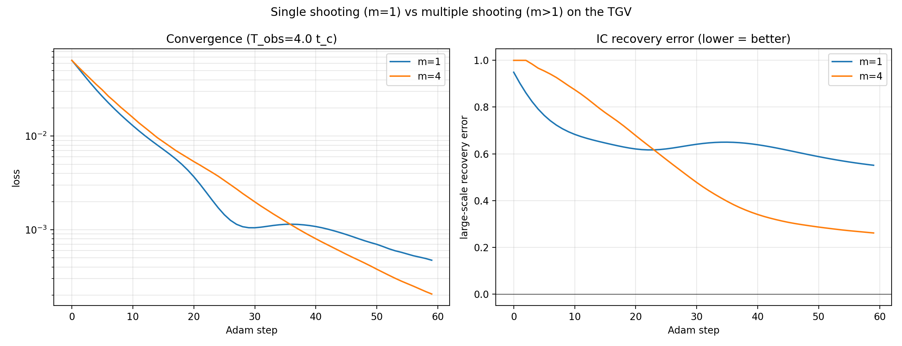
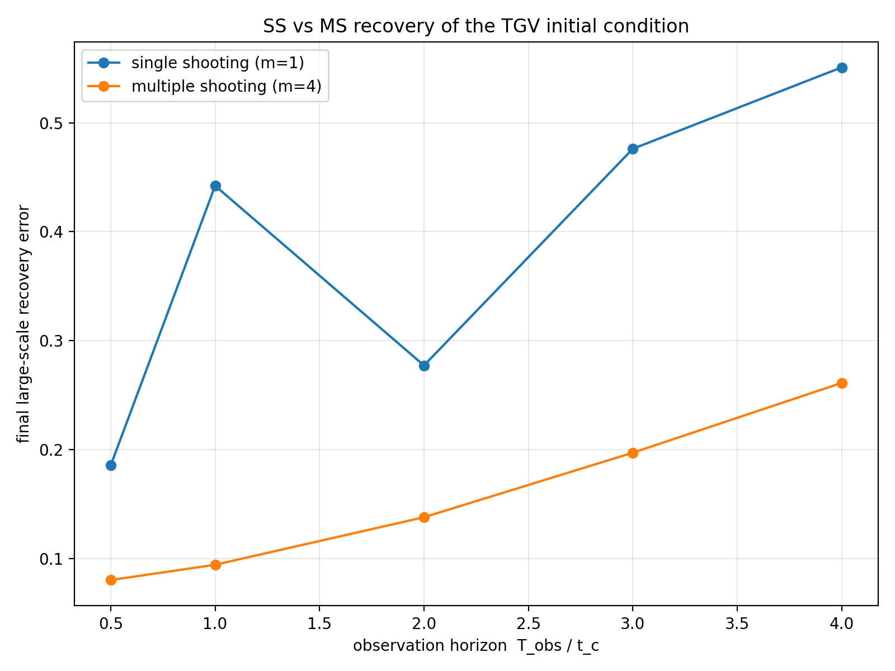

# Reduced- vs Full-Space Optimization on the 3D Compressible Taylor–Green Vortex

*A forward-then-inverse study realizing worked example II of `init_optim_theory.md` (§8), using the differentiable Hydro finite-difference (WENO) scheme in `astronomix`.*

---

## 1. Summary

We build the compressible Taylor–Green vortex (TGV) as a clean, analytically known large-scale flow that transitions to turbulence, then use the *same differentiable solver* to study the recovery of its initial condition from late-time observations — comparing **single shooting** (control = initial condition, full back-propagation) against **multiple shooting** (free interior segment states + consistency defects). The study is staged exactly as the theory recommends: first the cheap *adjoint-spectrum* diagnostic, then the full recovery comparison.

**Headline findings**

1. **The forward problem produces the turbulence we want.** From the smooth analytic vortex, the flow rolls up and breaks down into turbulence; kinetic-energy dissipation peaks at `t ≈ 8.25 t_c` and the kinetic-energy spectrum develops a `k^{-5/3}` inertial range — the textbook TGV transition.
2. **The single-shooting gradient pathology is real and scale-resolved.** The adjoint of a *large-scale* observable, back-propagated through the turbulent trajectory, piles up at high `k`: its small-scale band grows `∼ e^{1.43 (T)}` per turnover while its large-scale band decays. Segmentation caps this: the per-segment adjoint is a **sawtooth** that resets at every boundary.
3. **Multiple shooting recovers the initial condition where single shooting does not.** Across observation horizons `T_obs ∈ {0.5 … 4} t_c`, multiple shooting (`m=4`) holds the large-scale recovery error low (0.08 → 0.26) and degrades gently, while single shooting (`m=1`) is worse everywhere and rises/cliffs with horizon (up to 0.55), with the rugged, non-monotone signature of a multimodal landscape. At a fixed horizon the two methods reach *the same data misfit* but *different initial conditions* — the multimodality (axis 3), not the conditioning (axis 1), is what bites.

---

## 2. Method

A single differentiable kernel is shared by every experiment:

- **Scheme:** finite-difference 5th-order WENO hydrodynamics (`solver_mode = FINITE_DIFFERENCE`, `mhd = False`, `IDEAL_GAS`), `RK4_SSP` time integration, triply periodic box `[0, 2π]³`.
- **Initial condition (TGV):** `u = V₀ sin x cos y cos z`, `v = −V₀ cos x sin y cos z`, `w = 0`, `ρ = ρ₀`, `p = p₀ + (ρ₀V₀²/16)(cos 2x + cos 2y)(cos 2z + 2)`, with the background pressure set by a reference Mach number `Ma₀ = V₀/c₀ = 0.3` (subsonic, shock-free). Eddy-turnover unit `t_c = 1/(V₀ k₀) = 1`.
- **Differentiation:** reverse-mode AD through `time_integration` (`differentiation_mode = BACKWARDS` with `equinox` checkpointing). The Pallas backend is used for fast forward runs; on the backward pass it falls back to native JAX, so gradients are native either way (verified: native vs Pallas give identical gradients).
- **Single GPU** via `autocvd(num_gpus=1)` throughout (shared cluster).

---

## 3. Part I — Forward problem: TGV transition to turbulence

`taylor_green_vortex.py` (validated at 64³, final figures at 128³, Pallas backend).

### 3.1 Energy decay, dissipation, and enstrophy



The kinetic energy is flat during the laminar roll-up (`t ≲ 3.5`), then decays as the vortices break down. The dissipation rate `−dE_k/dt` and the enstrophy both rise from zero and peak near `t ≈ 8` (dissipation peak `t = 8.25`, enstrophy peak `t = 8.0`), bracketing the classic TGV breakdown time `t ≈ 9`. This is the vortex-stretching → transition the inverse problem needs.

### 3.2 Kinetic-energy spectrum



At `t = 0` all energy sits in the single large-scale TGV mode (`|k| = √3`). By the dissipation peak the energy has cascaded across all wavenumbers and tracks `k^{-5/3}` through the (resolution-limited) inertial range; the late-time field remains broadband.

### 3.3 Vorticity field



Vorticity-magnitude slices (`t = 0`, `t = 8.25` peak, `t = 19.75`): the smooth large-scale TGV sheets roll up into intricate filaments at peak dissipation, then fully developed small-scale turbulence — symmetry-preserving, as the TGV should be. (Animation: `figures/tgv_vorticity_N128.gif`.)

---

## 4. Part II — Inverse problem

All inverse experiments live in `inverse/`. Following §8, the **control is the large-scale band**: the initial velocity is the low-pass (`|k| ≤ 4`) projection of a real field, with small scales pinned to the prior. This fixes identifiability (axis 2) identically for every method, so single-vs-multiple-shooting differences are purely the gradient/basin story (axes 1 and 3).

### 4.1 Stage 1 — the scale-resolved adjoint spectrum (the "clean first cut")

`adjoint_spectrum.py`. We seed a fixed large-scale co-vector `w` (the TGV pattern) at the end of a horizon `T` and pull it back to `t = 0`; the gradient field `g_T = ∂⟨w, u(T)⟩/∂u₀` is the adjoint seeded by a large-scale observation. We track its kinetic-energy spectrum `E_g(k)` versus `T`.



- **Top:** the adjoint spectrum migrates to high `k` as the horizon grows — the spectral centroid climbs `⟨k⟩ = 1.9 → 12.6 → 20.0` over `T = 0.5 → 4 → 6`, accelerating right at the laminar→turbulent transition (`t ≈ 3.5`).
- **Bottom-right (the key panel):** splitting the gradient norm by band shows *where* the exponential lives. The **high-`k` band grows cleanly `∼ e^{1.43 T}`** (e-folding 0.70 `t_c`, the small-scale rate `∼ 1/τ_η`), while the **low-`k` band decays**. The *total* norm is dominated by — and therefore masked by — the decaying large-scale band until the small-scale band overtakes it around `T ≈ 3.5–4`. The exploding gradient is real, but it lives in the small scales; a large-scale observable's *total* sensitivity is robust.

**Turbulent restart.** Seeding the same large-scale observable from an already-turbulent state (TGV at `t = 8`) removes the laminar lag:



The high-`k` band now grows immediately from `t = 0` (centroid already `2.1–3.0` at small `T`, vs `≈1.9` in the laminar case) at rate `∼ e^{0.89 T}`. The total norm still stays large-scale-dominated — to make the *total* norm blow up one would seed a *small-scale* observable, which projects directly onto the unstable subspace. (Physically, recovering an IC from a fully turbulent start is ill-posed; this run is purely a gradient-pathology probe.)

### 4.2 The gradient mechanism: blow-up vs sawtooth, the forward envelope, and the basin

`gradient_mechanism.py` (48³).



- **(a) Adjoint sensitivity vs time-within-window** (`T = 4 t_c`). The high-`k` adjoint-band energy is plotted against the time `t` of the state being perturbed. For **single shooting** the gradient path always ends at the window end, so the adjoint grows *monotonically toward `t = 0`* (several decades of small-scale pile-up). For **multiple shooting** the path ends at the current segment boundary, so it is a **sawtooth that resets at every boundary**, capped at the value reached over one segment — `m = 8` (cap `e^{λ·0.5}`) sits below `m = 4` (cap `e^{λ·1}`). This is the structural fix: segmentation zeroes the slaved-state chain-rule product.

  *De-singularization.* The window is started from a de-singularized state (the TGV evolved to `t₀ = 2`) rather than the exact analytic single-mode IC. The pristine TGV is a measure-zero, maximally-coherent state (one Fourier mode, zero small-scale energy but maximal strain) that produces a strong **deterministic transient cascade** in the very first segment — an outlier spike (the first per-segment tooth reached `7.6e-7`, *above* even the fully turbulent fourth segment `4.2e-7`, which cannot be chaotic amplification). Starting the window from a developed state removes that pristine-mode artifact so the per-segment teeth follow a single clean envelope, isolating the chaotic `e^{λT/m}` growth that is the actual single-shooting obstacle.

- **(b) Tangent-linear forward growth.** A large-scale perturbation propagated *forward* along the trajectory (finite-difference tangent) develops high-`k` energy as it cascades — this deterministic-plus-chaotic forward growth of small-scale structure is the *envelope* that the adjoint teeth (and the single-shooting blow-up) ride on. It explains the general upward trend over the window: later, more-turbulent segments couple scales more strongly, so their per-segment sensitivity is larger.

- **(c) Optimization basin.** The loss along the line `ctrl = α · ctrl_truth` (truth at `α = 1`): single shooting integrates the whole window (the IC controls a strongly nonlinear late state → broad, shallow, slightly mislocated basin), while multiple shooting frees the interior states (the IC only has to match its own short first segment → a sharper, better-conditioned bowl centered on the truth). This is the weak-constraint / "expand the search space" effect — a landscape (axis 3) statement, not a conditioning one. The contrast is gentle here because the low-pass observation already smooths the landscape; it sharpens at longer horizons / less filtering.

### 4.3 Stage 2 — single vs multiple shooting recovery

`ss_vs_ms_recovery.py`. The control is the low-`k` initial velocity; the loss is the shared **step-defect** form

```
L = ‖ P_lk( F_h(s_{m-1}) ) − obs ‖²  +  (μ/2) · mean_j ‖ F_h(s_j) − s_{j+1} ‖²
```

with `F_h = ` one segment of the integrator (`t_end = T_obs/m`), `P_lk` the low-pass observation operator, and `obs` the filtered late-time velocity of the truth. The `m` segments are propagated in a Python outer loop around `_time_integration`; `m = 1` drops the defect term and is exactly single shooting. Optimized with Adam.

**Representative horizon (`T_obs = 4 t_c`, 120 steps):**



The **loss curves nearly coincide** (both reach `∼10⁻⁴`), yet the **recovery errors diverge** — single shooting plateaus at **0.47**, multiple shooting reaches **0.20**. Single shooting finds a state that fits the filtered data but is the *wrong* initial condition (a different basin); multiple shooting fits the data **and** recovers the true IC.

**Money plot — recovery error vs horizon** (32³, 60 Adam steps, `m = 1` vs `m = 4`):



| `T_obs / t_c` | single shooting (m=1) | multiple shooting (m=4) |
|---|---|---|
| 0.5 | 0.185 | 0.080 |
| 1.0 | 0.442 | 0.094 |
| 2.0 | 0.277 | 0.138 |
| 3.0 | 0.476 | 0.197 |
| 4.0 | 0.551 | 0.261 |

- **Multiple shooting wins at every horizon** and degrades only gently (0.08 → 0.26) — it holds the large scales across the whole window.
- **Single shooting is worse everywhere and trends upward/cliffs** with horizon (toward 0.55), and is **jagged / non-monotone** (spike at `T=1`, dip at `T=2`): the rugged-landscape signature of a multimodal problem — single shooting lands in *different local basins* at different horizons (the §7 "non-monotone, init-direction-fragile" behaviour), whereas multiple shooting's smooth curve reflects the better-conditioned, relaxed landscape.

---

## 5. Interpretation against the three axes

The study cleanly separates the theory's three failure axes (`init_optim_theory.md` §2):

- **Axis 1 (conditioning).** The adjoint-spectrum and sawtooth experiments make the exploding gradient explicit and *scale-resolved*: it is a small-scale (`∼ e^{λT}`, `λ ≈ 1.4/t_c`) phenomenon that segmentation caps per-segment. But the *total* large-scale gradient stays survivable — conditioning is the symptom, not the killer.
- **Axis 2 (identifiability)** is held fixed by design: the control is the low-`k` band, identical for all methods, and the observation is low-pass — so the differences are not about what is recoverable.
- **Axis 3 (basin / multimodality)** is what actually separates the methods: at `T_obs = 4` both methods reach the same data misfit but different ICs, and single shooting's money-plot curve is rugged and rises with horizon while multiple shooting's is smooth and low. The basin panel shows the state-space lift convexifying the landscape. This matches the central claim: *the killer is multimodality, not conditioning.*

---

## 6. Practical / numerical notes

- **Backend is irrelevant for differentiable runs.** Head-to-head (32³, 8 Adam steps): native 233 s vs Pallas 207 s, with *identical* gradients/recovery error (0.636). The native VJP backward dominates, so the fast Pallas forward only buys ~11%.
- **Native backprop is the cost wall.** One Adam optimization is hours at 32³ (the `T_obs = 4`, 120-step run took ~3.4 h for `m=1`); the per-step cost grows superlinearly with resolution and horizon (checkpoint recompute). The money-plot sweep was therefore run at 32³ / 60 steps, serialized on one GPU (~7 h total). Inverse studies here want low resolution (≤ 64³) and `num_checkpoints` tuned to memory.
- **Convergence caveat.** 60 Adam steps at 32³ reliably exposes the SS-vs-MS *contrast* but is not fully converged; the `T_obs = 4` point is more converged at 120 steps (0.468 / 0.203). Absolute error levels would drop with more steps / higher resolution; the qualitative ordering is robust.

---

## 7. Limitations and next steps

- **Richer `m`-dependence** (`m = 2, 8`) to trace the cost/robustness U-curve (§7 notes there is no intermediate-`m` *accuracy* sweet spot — the case for intermediate `m` is cost × robustness).
- **Scale-decomposed recovery error** requires a *broadband* truth IC (the current TGV truth is purely low-`k`, so high-`k` is trivially absent); it would show "low-`k` recovered, high-`k` pinned at the prior for every method" — the axis-2 visual.
- **Full-space (`m = N_t`) limit** and a **homotopy / continuation** initialization for single shooting (the standard cure for the multimodality it suffers).
- **Resolution / convergence confirmation** at 64³ with more Adam steps (costly but a feasible overnight job).

---

## 8. Reproduction

| File | Produces |
|---|---|
| `taylor_green_vortex.py` | forward TGV: `figures/tgv_{energy,spectrum,vorticity}_N{64,128}.*` |
| `inverse/adjoint_spectrum.py` | `inverse/figures/adjoint_spectrum_{laminar,turbulent}.png` |
| `inverse/gradient_mechanism.py` | `inverse/figures/gradient_mechanism.png` |
| `inverse/ss_vs_ms_recovery.py` | `inverse/figures/ss_vs_ms_Tobs*.png` (env: `TGV_N, TGV_TOBS, TGV_M, TGV_STEPS, TGV_BACKEND`) |
| `inverse/aggregate_money_plot.py` | `inverse/figures/money_plot.png` |

Example — reproduce the money plot:

```bash
cd tests/taylor_green/inverse
for T in 0.5 1 2 3 4; do
  TGV_N=32 TGV_TOBS=$T TGV_M=1,4 TGV_STEPS=60 python ss_vs_ms_recovery.py
done
python aggregate_money_plot.py
```

All runs use `autocvd(num_gpus=1)`; for the differentiable runs the backend choice does not affect the gradient. Raw arrays are cached as `*.npz` under `data/` and `inverse/data/` so figures can be regenerated without recomputing.

---

*Generated as part of the `astronomix` differentiable-MHD inverse-modeling study; theory and references in `init_optim_theory.md`.*
